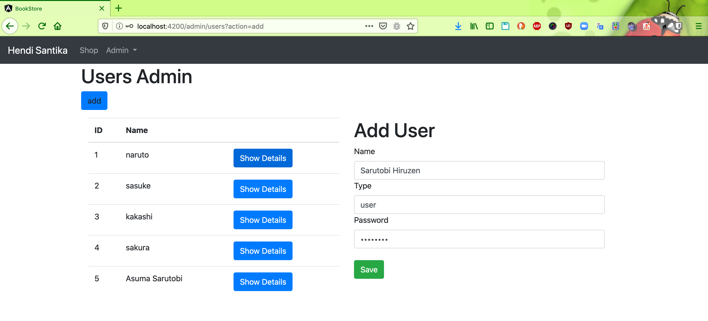
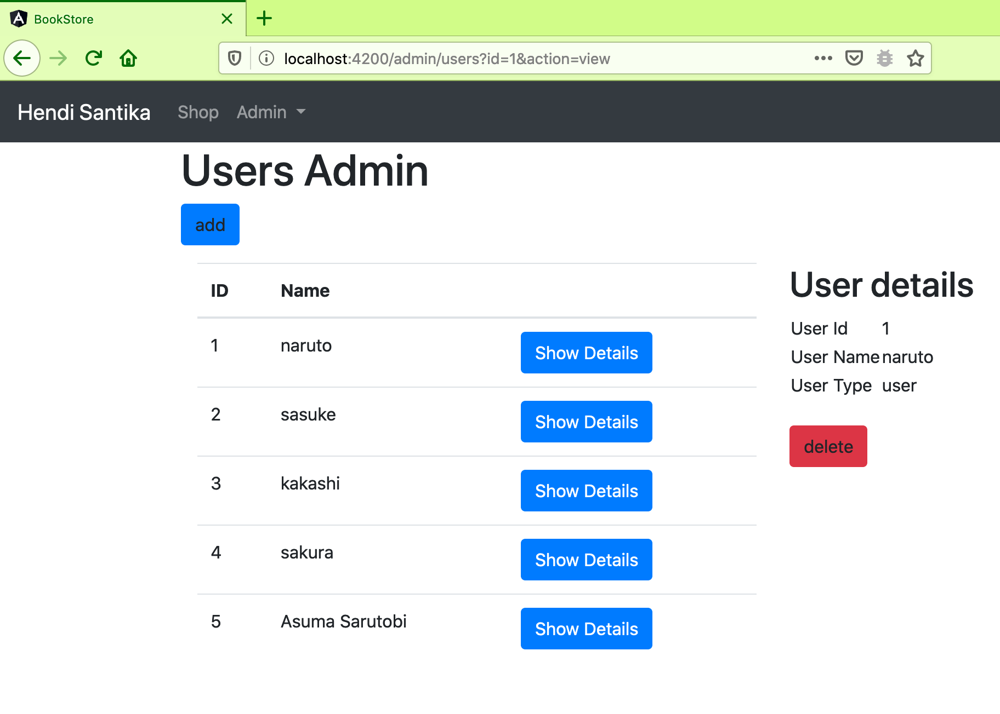
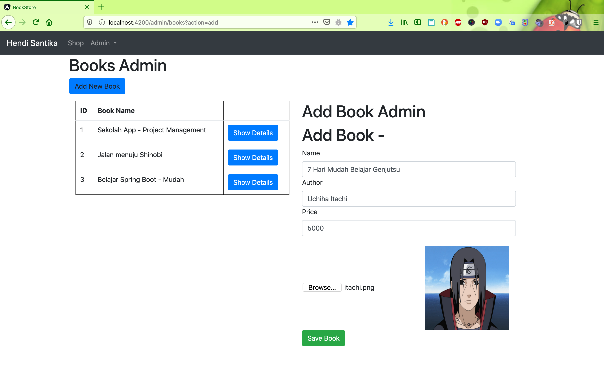
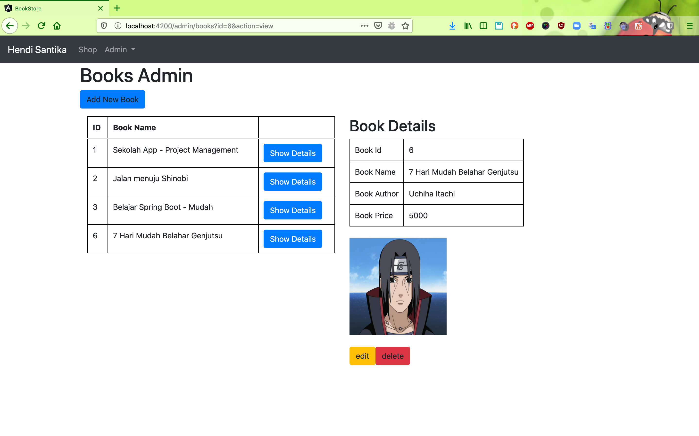

# online-book-store
### Thing todo list:
1. Clone this repository: `git clone https://github.com/hendisantika/online-book-store.git`
2. Go inside the folder: `cd online-book-store`
3. Run the application: `gradle clean bootRun --info`
4. Open new terminal console then go inside frontend folder: `cd frontend`
5. Run `npm install`
6. Run `ng serve -o`

### Screen shot

Add New User

List Users

Shop Books

Add New Book

Book Details

Book Order

Book Cart

 
